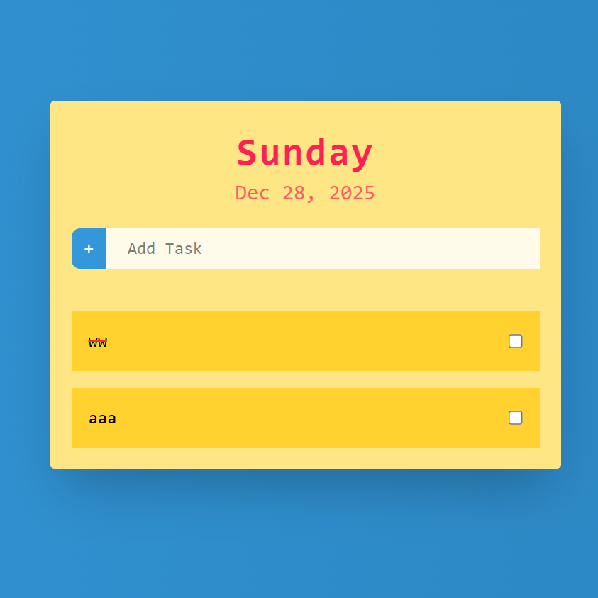

# Simple To-Do List

A lightweight To-Do List web application built with HTML, CSS, and JavaScript.  
This app allows users to manage tasks efficiently with CRUD operations, all stored in the browser's localStorage.

---

## Features

- **Create, Read, Update, Delete (CRUD)** tasks.
- Click a task to mark it as **completed** with a line-through style.
- Use the checkbox to **delete tasks**.
- Display **current day and date** automatically.
- Persistent storage using localStorage.
- Fully deployed and accessible online: https://thelonesoul.github.io/Todo-List

---

## Demo

---

## Source Code

All source code files are located inside the `docs` folder.

---

## How It Works

- Tasks are displayed as list items with checkboxes.
- Clicking a task toggles **completed** state and applies a line-through.
- Clicking the checkbox deletes the task and updates localStorage.
- All tasks persist across page reloads.

---

## Technologies Used

- HTML
- CSS
- JavaScript
- Browser localStorage

---

## License

This project is open-source under the [MIT License](LICENSE).
